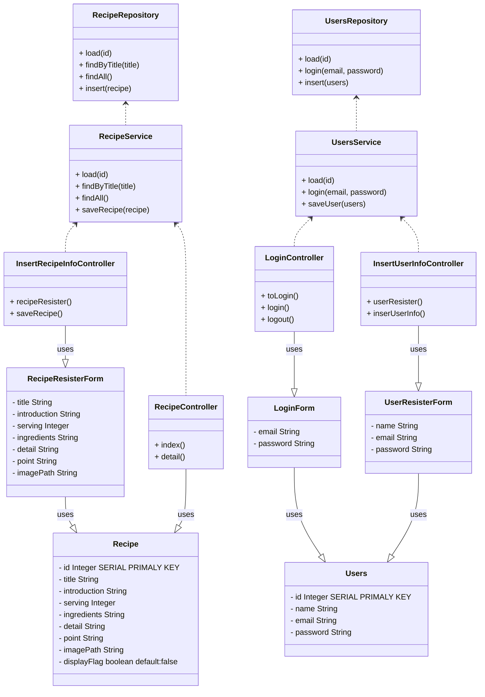

```mermaid
classDiagram

    class Recipe {
        - id Integer SERIAL PRIMALY KEY
        - title String
        - introduction String
        - serving Integer
        - ingredients String
        - detail String
        - point String
        - imagePath String
        - displayFlag boolean default:false
    }

    class Users {
        - id Integer SERIAL PRIMALY KEY
        - name String
        - email String
        - password String
    }

    class RecipeRepository {
        + load(id)
        + findByTitle(title)
        + findAll()
        + insert(recipe)
    }

    class UsersRepository {
        + load(id)
        + login(email, password)
        + insert(users)
    }

    class RecipeService {
        + load(id)
        + findByTitle(title)
        + findAll()
        + saveRecipe(recipe)
    }

    class UsersService {
        + load(id)
        + login(email, password)
        + saveUser(users)
    }

    class LoginForm {
        - email String
        - password String
    }

    class UserResisterForm {
        - name String
        - email String
        - password String
    }

    class RecipeResisterForm {
        - title String
        - introduction String
        - serving Integer
        - ingredients String
        - detail String
        - point String
        - imagePath String
    }

    class LoginController {
        + toLogin()
        + login()
        + logout()
    }

    class InsertUserInfoController {
        + userResister()
        + inserUserInfo()
    }

    class RecipeController {
        + index()
        + detail()
    }

    class InsertRecipeInfoController {
        + recipeResister()
        + saveRecipe()
    }

    LoginForm --|> Users : uses
    LoginController --|> LoginForm : uses

    UserResisterForm --|> Users :uses
    InsertUserInfoController --|> UserResisterForm :uses

    RecipeResisterForm --|> Recipe : uses
    InsertRecipeInfoController --|> RecipeResisterForm : uses

    RecipeController --|> Recipe : uses


    UsersRepository <.. UsersService 

    UsersService <.. LoginController 
    UsersService<.. InsertUserInfoController

    RecipeRepository <.. RecipeService

    RecipeService <.. RecipeController
    RecipeService <.. InsertRecipeInfoController


```