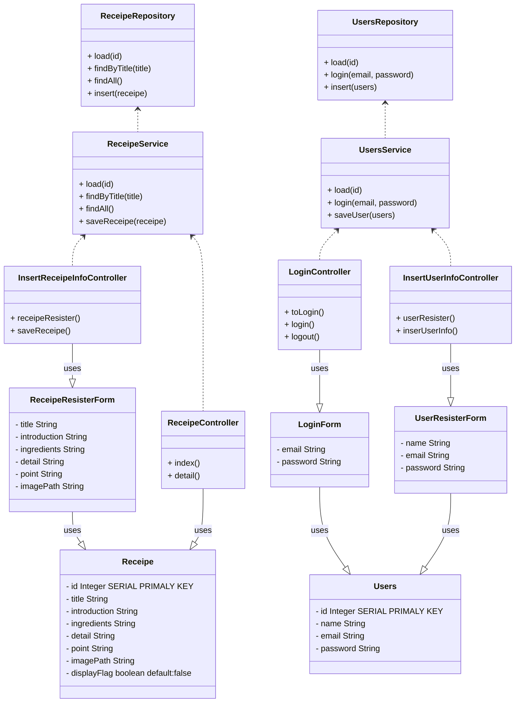

```mermaid
classDiagram

    class Receipe {
        - id Integer SERIAL PRIMALY KEY
        - title String
        - introduction String
        - ingredients String
        - detail String
        - point String
        - imagePath String
        - displayFlag boolean default:false
    }

    class Users {
        - id Integer SERIAL PRIMALY KEY
        - name String
        - email String
        - password String
    }

    class ReceipeRepository {
        + load(id)
        + findByTitle(title)
        + findAll()
        + insert(receipe)
    }

    class UsersRepository {
        + load(id)
        + login(email, password)
        + insert(users)
    }

    class ReceipeService {
        + load(id)
        + findByTitle(title)
        + findAll()
        + saveReceipe(receipe)
    }

    class UsersService {
        + load(id)
        + login(email, password)
        + saveUser(users)
    }

    class LoginForm {
        - email String
        - password String
    }

    class UserResisterForm {
        - name String
        - email String
        - password String
    }

    class ReceipeResisterForm {
        - title String
        - introduction String
        - ingredients String
        - detail String
        - point String
        - imagePath String
    }

    class LoginController {
        + toLogin()
        + login()
        + logout()
    }

    class InsertUserInfoController {
        + userResister()
        + inserUserInfo()
    }

    class ReceipeController {
        + index()
        + detail()
    }

    class InsertReceipeInfoController {
        + receipeResister()
        + saveReceipe()
    }

    LoginForm --|> Users : uses
    LoginController --|> LoginForm : uses

    UserResisterForm --|> Users :uses
    InsertUserInfoController --|> UserResisterForm :uses

    ReceipeResisterForm --|> Receipe : uses
    InsertReceipeInfoController --|> ReceipeResisterForm : uses

    ReceipeController --|> Receipe : uses


    UsersRepository <.. UsersService 

    UsersService <.. LoginController 
    UsersService<.. InsertUserInfoController

    ReceipeRepository <.. ReceipeService

    ReceipeService <.. ReceipeController
    ReceipeService <.. InsertReceipeInfoController


```