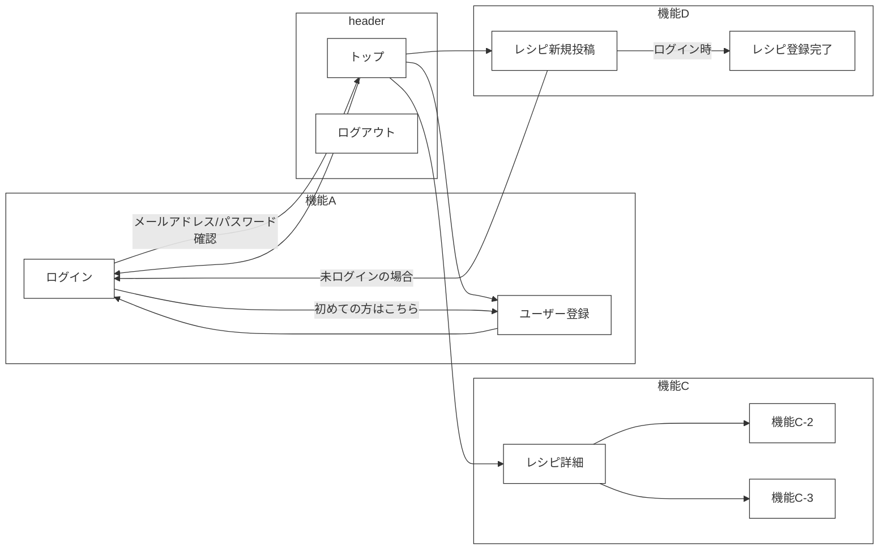

```mermaid
graph LR
  classDef default fill: #fff,stroke: #333,stroke-width: 1px;
  style funcA fill: #fff,stroke: #333,stroke-width: 1px;
  style funcC fill: #fff,stroke: #333,stroke-width: 1px;
  style funcD fill: #fff,stroke: #333,stroke-width: 1px;
  style header fill: #fff,stroke: #333,stroke-width: 1px;

  ログイン -- メールアドレス/パスワード確認 --> トップ

  トップ --> ログイン
  トップ --> ユーザー登録
  トップ --> レシピ詳細
  トップ --> レシピ新規投稿

  subgraph funcA [機能A]
    ログイン -- 初めての方はこちら --> ユーザー登録 --> ログイン
  end

 

  subgraph funcC [機能C]
    レシピ詳細 --> 機能C-2
    レシピ詳細 --> 機能C-3
  end

  subgraph funcD [機能D]
    レシピ新規投稿 -- 未ログインの場合 --> ログイン
    レシピ新規投稿 -- ログイン時 --> レシピ登録完了
  end

  

  subgraph header
    ログアウト
    トップ
    レシピ新規投稿
  end

```