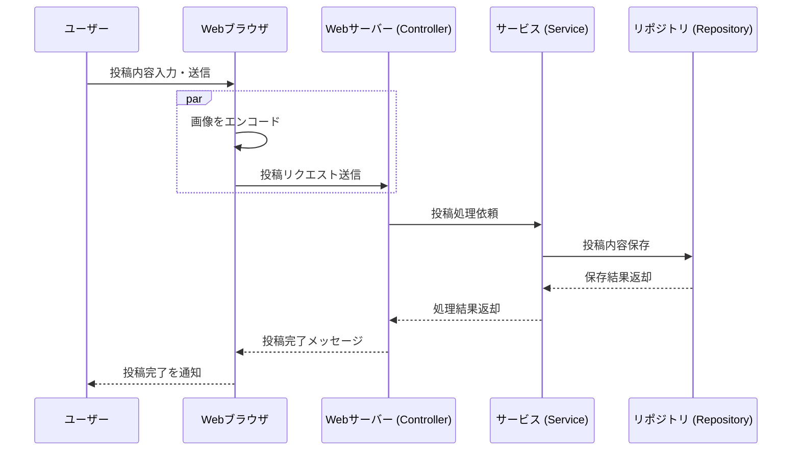

```mermaid
sequenceDiagram
    participant User as ユーザー
    participant Browser as Webブラウザ
    participant Controller as Webサーバー (Controller)
    participant Service as サービス (Service)
    participant Repository as リポジトリ (Repository)

    User ->> Browser: 投稿内容入力・送信
    par
        Browser ->> Browser: 画像をエンコード
        Browser ->> Controller: 投稿リクエスト送信
    end
    Controller ->> Service: 投稿処理依頼
    Service ->> Repository: 投稿内容保存
    Repository -->> Service: 保存結果返却
    Service -->> Controller: 処理結果返却
    Controller -->> Browser: 投稿完了メッセージ
    Browser -->> User: 投稿完了を通知

```